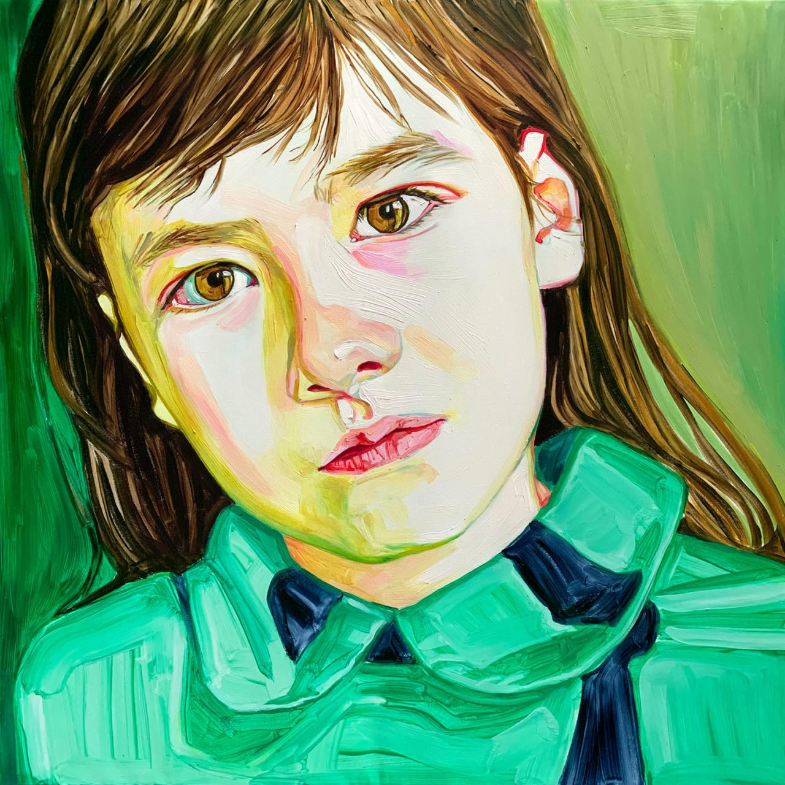
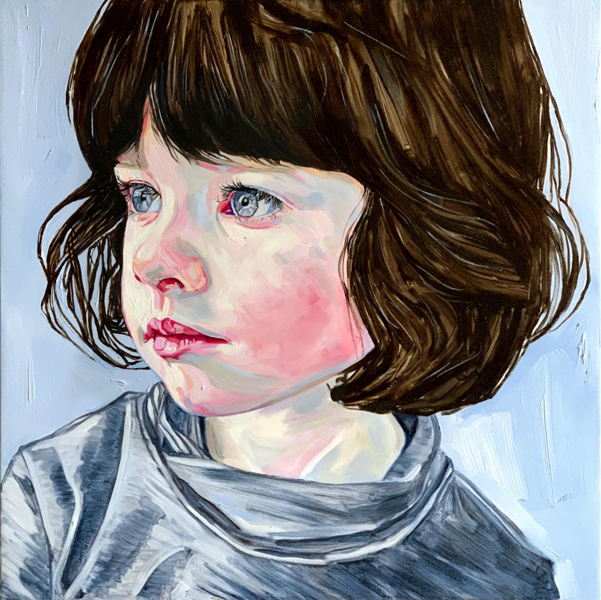
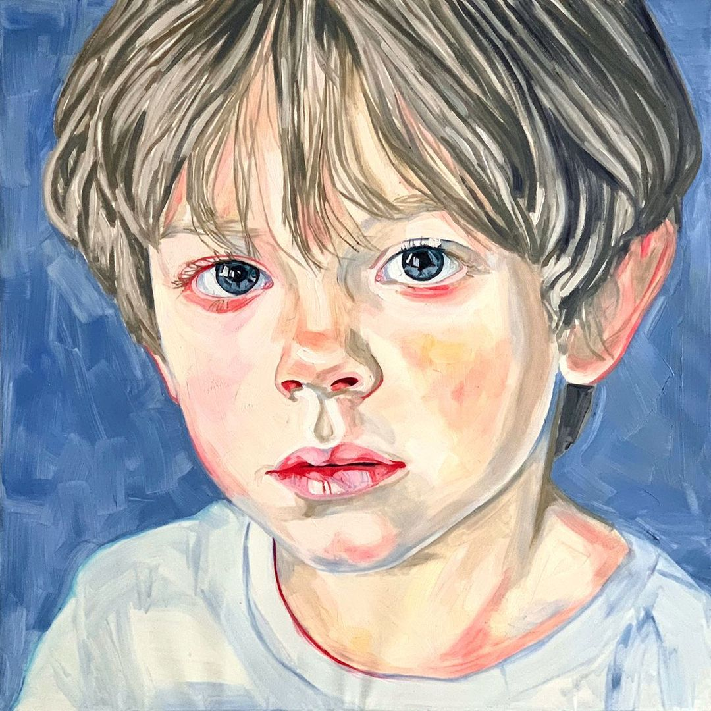
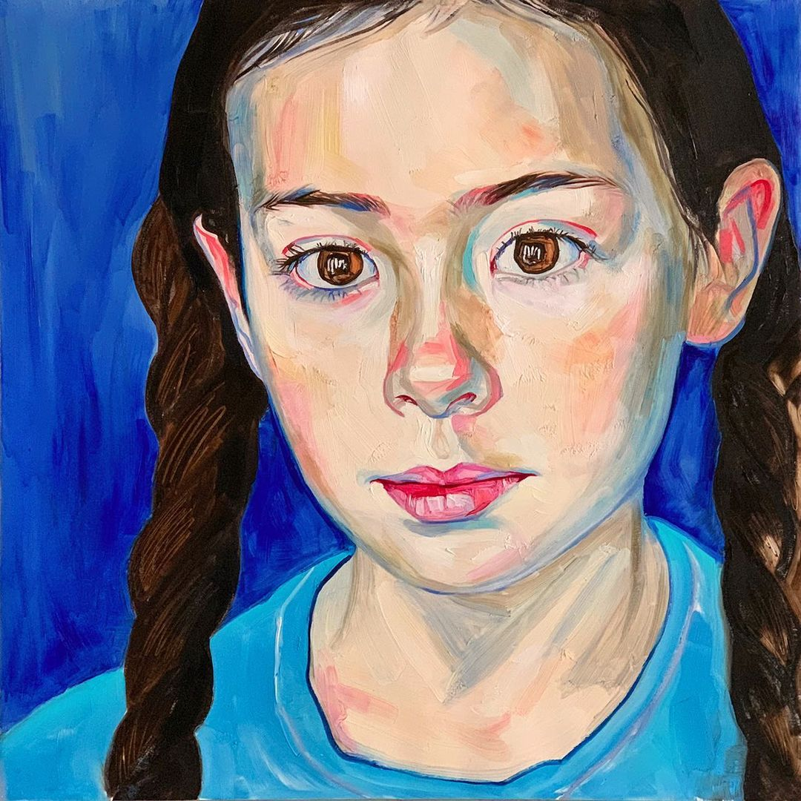
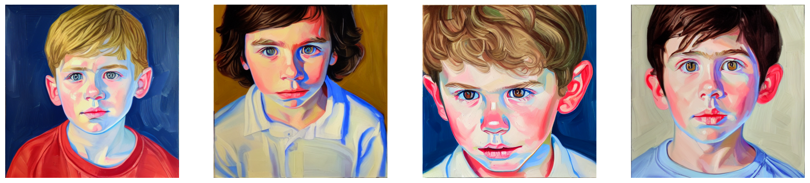
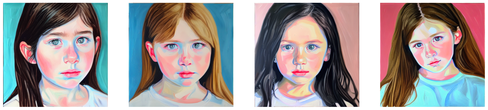

## Style-Dreambooth

[//]: # (Fine-tuned diffusion model trained to extract style patterns from a small set of samples by an artist.)


The goal of this project is to present how to extract style patterns from a limited set of samples from an artist. Current baseline solution is based on the Dreambooth technique for fine-tuning diffusion models (see the paper: [DreamBooth: Fine Tuning Text-to-Image Diffusion Models for Subject-Driven Generation](https://arxiv.org/pdf/2208.12242)).

#### Source Data

<p float="left">
   
   
   
 
</p>

#### Generated Samples



### Code

The training and inference code is available in the `./scripts` directory. The scripts are reproducible in a Google Colab notebook with a T4 GPU.

### Training Configurations

To effectively train the model, we need to consider the following:

- We should have a consistent set of images that share a similar style in our training data.
- We need a special rare token that identifies the concept we would like to learn from the data. In this case, we aim to understand an art style, which will be specified in the instance prompt.
- Regularization can be applied using a prior-preservation loss by forcing the pre-trained model to generate the desired concept. Pre-generated images will be used to calculate the loss during training by specifying the necessary parameters for class prompts and the number of class images.
- We can fine-tune the text encoder along with the UNet, which yields better results for face generation.

As a pretrained backbone, I would use the most popular pre-trained Stable Diffusion 1.5 from Hugging Face: [Stable Diffusion 1.5](https://huggingface.co/runwayml/stable-diffusion-v1-5). 

Below is the main training script with training parameters based on an open-source diffusers repository: [Diffusers Repo](https://github.com/huggingface/diffusers/tree/main/examples/dreambooth).


```python 
accelerate launch train_dreambooth.py \
  --pretrained_model_name_or_path="runwayml/stable-diffusion-v1-5" \
  --revision=$BRANCH \
  --instance_prompt="yltcaxe artstyle" \
  --class_prompt="artstyle" \
  --class_data_dir=$CLASS_DIR \
  --instance_data_dir=$INSTANCE_DIR \
  --output_dir=$OUTPUT_DIR \
  --with_prior_preservation --prior_loss_weight=1.0 \
  --seed=1337 \
  --resolution=512 \
  --train_batch_size=1 \
  --train_text_encoder \
  --use_8bit_adam \
  --gradient_accumulation_steps=1 \
  --learning_rate=1e-6 \
  --lr_scheduler="constant" \
  --lr_warmup_steps=0 \
  --num_class_images=50 \
  --sample_batch_size=4 \
  --max_train_steps=800
```

### Tech report & notes
#### Experiments

I conducted a set of experiments to analyze the effect of different settings, including:

- Changing the number of training steps and the learning rate.
- Modifying the class prompt for prior preservation loss (e.g., using "portrait" instead of "artstyle") and adjusting the number of generated class images.

Additional steps that can be taken beyond the experiments described above include changing the backbone of the pretrained model.


#### Common Observations

- The model can overfit with more training steps and may start to generate similar objects (e.g., this is noticeable with 1600 steps).
- Training the text encoder alongside the UNet helps improve results.
- Using regularization images and prior preservation loss enhances performance.


#### Failure Cases

I observed issues with generating multiple objects, such as "girl and a boy" or "man with a dog." I propose that this can be addressed, for instance, using ControlNet techniques or by adding extra conditions during inference. For example, we can pass reference conditions like image sketches with a rough outline of the desired arrangement of objects.